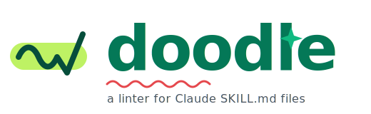
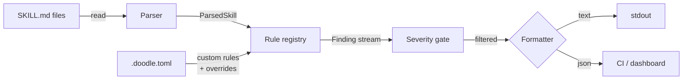

<p align="center">
  <picture>
    <source media="(prefers-color-scheme: dark)" srcset="./docs/assets/logo-banner-dark.svg">
    
  </picture>
</p>

<p align="center">
  <em>A linter for Claude <code>SKILL.md</code> files.</em><br/>
  <em>Catches the vague descriptions, oversized bodies, and silent trigger failures that keep skills from firing.</em>
</p>

<p align="center">
  <a href="#install"></a>
  <a href="./LICENSE"></a>
  <a href="./RULES.md"></a>
  <a href="./docs/ARCHITECTURE.md"></a>
  <a href="./docs/WHY.md"></a>
</p>

---

## What it is

In late 2025 Anthropic introduced `SKILL.md`, a markdown with YAML frontmatter that teaches Claude a new capability. By mid-2026 there are **5,000+ published skills** and Anthropic's own issue tracker says **80% of trigger failures come from vague descriptions** ([anthropics/skills#267](https://github.com/anthropics/skills/issues/267)).

There's no quality bar. Marketplaces accept anything. Authors can't tell if their skill will fire until production.

doodle is the smallest useful thing in front of that gap: **12 rules grounded in real samples, one command, sub-second feedback**.

```bash
pip install doodle-lint
doodle path/to/SKILL.md
```

That's it. No LLM calls, no API keys, no cloud.

---

## Quick taste

A real skill from the wild, trimmed for length, but the smells are verbatim:

<table>
<tr>
<td>

**Before** 

```yaml
---
name: code-reviewer
description: An expert assistant
  that helps developers with reviewing
  code, reviewing pull requests, writing
  tests, writing code, building features,
  debugging code, answering questions
  about programming, and generally being
  helpful with any coding tasks they may
  have on any project at any time.
---

# Code Reviewer
... 1,089 lines ...
```

</td>
<td>

**doodle says**

```
SKILL.md
  3:1   warning  Description is 282 characters (max 250)        desc/too-long
  3:1   warning  No 'Use when…' / 'Trigger with…' phrase        desc/no-trigger-phrase
  3:1   warning  Trigger overlaps default Claude behavior:      desc/vague-trigger
                 'reviewing code', 'reviewing pull requests',
                 'writing tests', 'building features',
                 'debugging code', 'answering questions'
  13:1  warning  Body is 1089 lines (soft cap 500)              body/too-long
```

Plus an actionable suggestion under each finding.

</td>
</tr>
</table>

---

## Install

```bash
pip install doodle-lint
```

Requires Python 3.10+. Two runtime deps: `PyYAML` + `tomli` (on <3.11).

---

## Meet doodle

<table>
<tr>
<td width="200" align="center">
  
</td>
<td>
  <em>"Hi! I'm doodle. I just read your <code>SKILL.md</code>, I've found a couple of things. The description is doing too much, and there's a <code>/Users/...</code> path on line 47 that won't survive on anyone else's machine. Want me to show you?"</em>
  <br/><br/>
  <sub>Sub-second feedback. Citations on every finding. No LLM bill.</sub>
</td>
</tr>
</table>

---

## Use

```bash
# lint a single skill
doodle path/to/SKILL.md

# walk a directory recursively
doodle ./skills

# CI-friendly JSON
doodle ./skills --format=json

# explain a rule
doodle --explain desc/vague-trigger

# list everything we check
doodle --list-rules

# turn the dial up
doodle --strict ./skills          # info → warning, warning → error

# silence rules you've decided against
doodle --ignore=body/emoji ./skills
```

**Exit codes:** `0` clean, `1` warnings, `2` errors, `3` tool error.

---

## In CI (GitHub Action)

```yaml
- uses: krishyaid-coder/doodle@v0
  with:
    path: ./skills
    strict: true        # optional
    fail-on: warning    # warning (default) | error | never
```

---

## What it catches (v0)

12 rules across 4 categories. Each rule has a citation to Anthropic docs or community evidence, never just "we think this is bad."

| Rule | Severity | What |
|---|---|---|
| `desc/too-long` | warning | Description > 250 chars |
| `desc/too-short` | warning | Description < 60 chars or missing |
| `desc/no-trigger-phrase` | warning | No "Use when…" / "Trigger with…" phrasing |
| `desc/vague-trigger` | warning | Trigger overlaps Claude's default behavior |
| `body/too-long` | warning | Body > 500 lines |
| `body/way-too-long` | error | Body > 1500 lines |
| `body/absolute-user-path` | warning | `/Users/`, `/home/`, `~/` outside fences |
| `body/emoji` | info *(off by default)* | Emoji in body — opt in via `--strict` or `[severity] "body/emoji" = "info"` in config |
| `fm/name-mismatch-dir` | warning | `name:` doesn't match parent directory |
| `fm/missing-allowed-tools` | warning | Extended dialect uses tools but skips scoping |
| `fm/unknown-field` | info | Anthropic dialect has non-standard fields |
| `hygiene/desc-blank-lines` | info | Description has embedded blank lines |

Full spec, with examples and citations: [RULES.md](./RULES.md).

---

## Architecture

One Python package, six source files, a clear rule-engine spine. Files in → parsed skill → rule registry → findings out.



- **Parser**: splits frontmatter from body, auto-detects dialect.
- **Rule registry**: runs built-in + custom rules, applies severity overrides, filters by dialect and per-path globs.
- **Custom rules**: pattern + frontmatter-required, loaded from `.doodle.toml` at startup, plug in alongside built-ins.
- **Formatter**: renders findings as colored text or JSON for CI.

Full component table, sequence diagrams, and extension points: [docs/ARCHITECTURE.md](./docs/ARCHITECTURE.md).

---

## Dialects

Two `SKILL.md` dialects exist in the wild. doodle auto-detects.

- **anthropic**: minimal frontmatter: `name`, `description`, optional `license`. Used by [`anthropics/skills`](https://github.com/anthropics/skills).
- **extended**: community schema with `version`, `author`, `tags`, `allowed-tools`. Used by [`alirezarezvani/claude-skills`](https://github.com/alirezarezvani/claude-skills), [`jeremylongshore/claude-code-plugins-plus-skills`](https://github.com/jeremylongshore/claude-code-plugins-plus-skills), [`DietrichGebert/ponytail`](https://github.com/DietrichGebert/ponytail).

Some rules apply to both. Some are dialect-scoped. We don't pretend the split doesn't exist.

---

## Custom rules for your team or company

Drop a `.doodle.toml` in your project root. No Python required for the common cases.

```toml
[options]
dialect = "extended"
fail-on = "warning"

# Disable or change severity of any rule (built-in or custom)
[severity]
"body/emoji" = "off"
"body/too-long" = "info"

# Per-path overrides — strict in prod/, lax in experiments/
[[paths]]
glob = "**/experiments/**/SKILL.md"
disabled = ["desc/vague-trigger", "body/too-long"]

# Custom regex rule
[[rules]]
id = "acme/no-customer-pii"
kind = "pattern"
pattern = "(?i)\\bcustomer_[a-z]+\\b"
applies-to = "body"            # body | description | name
severity = "error"
message = "Customer PII tokens are not allowed in skills."
suggestion = "Use 'user_<role>' instead."

# Custom frontmatter requirement
[[rules]]
id = "acme/require-team-tag"
kind = "frontmatter-required"
fields = ["team", "data-classification"]
severity = "error"
message = "Internal skills must declare team + data-classification."
```

Run as normal: `doodle ./skills`. The config is discovered up the directory tree, or pass `--config`.

Need real Python logic? See [docs/EXTENDING.md](./docs/EXTENDING.md#add-a-rule-12-lines) for the Python-rule path.

---

## Roadmap

| Phase | What | Status |
|---|---|---|
| **v0** | Static linter — 12 rules, CLI + GitHub Action | shipped |
| **v0.2** | `.doodle.toml` config, custom pattern + required-fields rules, per-path overrides, severity overrides | shipped |
| **v1** | `--fix` for auto-fixable rules (blank lines, trailing whitespace), SARIF output for GitHub code scanning, helpful suggestions on parse errors | next |
| **Phase 2** | `doodle eval` — trigger-accuracy scoring on top of [Promptfoo's `skill-used` assertion](https://www.promptfoo.dev/docs/guides/test-agent-skills/) | designed |
| **Phase 3** | VS Code extension — inline lint diagnostics as you author `SKILL.md` (real-time feedback for non-technical authors) | designed |
| **Phase 4** | Hosted scanner + Quality Badge for skill READMEs | exploring |

See [docs/ARCHITECTURE.md](./docs/ARCHITECTURE.md) for how the current code absorbs Phase 2 without rewrite.

---

## Why this exists, in one paragraph

A linter is not impact. **Adopted rules** are impact. I am not building this because there should be a linter; I am building it because there are 5,000 skills in the wild, 40–60% have a clear quality smell, Anthropic's own issue tracker quantifies the failure modes, and nobody has put together the static-checks half + the trigger-accuracy half before. The longer version, including the honest risks: [docs/WHY.md](./docs/WHY.md).

---

## Docs

- [Architecture](./docs/ARCHITECTURE.md) — diagrams, components, extension points, trade-offs
- [Rule spec](./RULES.md) — every rule with citation, example, in-sample frequency
- [Extending](./docs/EXTENDING.md) — add a rule in 12 lines
- [Why doodle](./docs/WHY.md) — the impact argument
- [Contributing](./CONTRIBUTING.md) — ground rules + PR checklist

---

## License

[MIT](./LICENSE).

The CLI and rule-set are MIT forever. Future hosted services will be a separate repo with a separate license.
