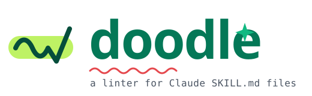
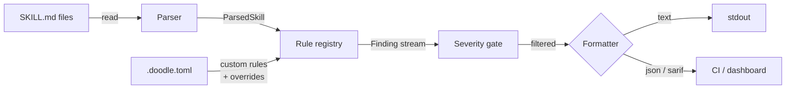

<p align="center">
  <picture>
    <source media="(prefers-color-scheme: dark)" srcset="./docs/assets/logo-banner-dark.svg">
    
  </picture>
</p>

<p align="center">
  A linter for Claude <code>SKILL.md</code> files. Catches vague descriptions, oversized bodies, hardcoded paths, and silent trigger failures.
</p>

<p align="center">
  <a href="./LICENSE"></a>
  <a href="./RULES.md"></a>
  <a href="https://open-vsx.org/extension/krishyaid-coder/doodle-lint"></a>
  <a href="./docs/QUALITY_REPORT.md"></a>
</p>

---

## Overview

In late 2025 Anthropic introduced `SKILL.md`, a markdown format with YAML frontmatter that extends Claude with custom skills. By mid-2026 more than 5,000 skills have been published across community marketplaces. Anthropic's own issue tracker attributes 80% of skill trigger failures to vague descriptions ([anthropics/skills#267](https://github.com/anthropics/skills/issues/267)), yet no static tooling for the format existed.

doodle closes that gap. Twelve static rules, each citing Anthropic's authoring guide or a documented community issue, plus a trigger-accuracy harness for measuring whether skills actually fire on natural-language prompts.

## Install

```bash
pip install doodle-lint
```

Requires Python 3.10 or newer. Runtime dependencies: `PyYAML`, and `tomli` on Python 3.10. PyPI publication is pending; once complete, `pip install doodle-lint` will work.

Verify:

```bash
doodle --version
doodle --list-rules
```

## Usage

```bash
# Scaffold a new skill that passes the linter out of the box
doodle init my-skill --eval          # creates ./my-skill/{SKILL.md,eval.yaml}

# Lint a single skill
doodle path/to/SKILL.md

# Lint a directory recursively
doodle ./skills

# JSON output for CI
doodle ./skills --format=json

# SARIF output for GitHub code scanning
doodle ./skills --format=sarif > doodle.sarif

# Apply auto-fixes for safe rules
doodle ./skills --fix

# Promote info to warning, warning to error
doodle --strict ./skills

# Disable a specific rule
doodle --ignore=body/emoji ./skills

# Explain a rule
doodle --explain desc/vague-trigger
```

Exit codes: `0` clean, `1` warnings, `2` errors, `3` tool error.

### Phase 2: trigger-accuracy eval

```bash
# Requires: pip install ".[eval]", npm install -g promptfoo, ANTHROPIC_API_KEY
doodle eval --generate path/to/SKILL.md    # Draft a starter eval.yaml via Claude
doodle eval path/to/SKILL.md               # Run the eval, report the score
doodle eval path/to/SKILL.md --dry-run     # Preview the Promptfoo config
```

Full workflow: [docs/EVAL.md](./docs/EVAL.md).

## VS Code / Cursor extension

The extension is published on the [Open VSX Registry](https://open-vsx.org/extension/krishyaid-coder/doodle-lint) and works in Cursor, VSCodium, Windsurf, and VS Code with Open VSX enabled.

Features: real-time diagnostics, status bar with finding counts, hover messages linking to the rule catalog, quick-fix code actions for fixable rules, and a `doodle eval` bridge command.

Install from your editor's Extensions panel (search `doodle`), or via CLI:

```bash
# Cursor, VSCodium, Windsurf (Open VSX is the default gallery)
code --install-extension krishyaid-coder.doodle-lint

# Vanilla VS Code: install the VSIX from the latest GitHub Release
curl -L -o /tmp/doodle.vsix \
  https://github.com/krishyaid-coder/doodle/releases/latest/download/doodle-lint-0.2.0.vsix
code --install-extension /tmp/doodle.vsix
```

The extension shells out to the CLI installed above. Upgrading the CLI upgrades the extension's rules automatically.

Full extension docs: [vscode/README.md](./vscode/README.md).

## CI (GitHub Action)

```yaml
- uses: krishyaid-coder/doodle@v0
  with:
    path: ./skills
    strict: true
    fail-on: warning   # warning | error | never
```

## Rules

Each rule cites either Anthropic's authoring documentation or a documented community issue. Full spec with examples, in-sample frequency, and citations: [RULES.md](./RULES.md).

## Quality badge

Skill authors can advertise the doodle grade of their `SKILL.md` in the skill's own README:

```bash
doodle badge path/to/SKILL.md
```

Prints a shields.io-backed markdown snippet, for example:

```markdown
[](https://github.com/krishyaid-coder/doodle)
```

Grade rubric:

| Grade | Meaning                                                            |
| ----- | ------------------------------------------------------------------ |
| A+    | Zero findings                                                      |
| A     | Info-level findings only                                           |
| B     | 1 or 2 warnings, no errors                                         |
| C     | 3 or 4 warnings, no errors                                         |
| D     | 5 or more warnings, no errors                                      |
| F     | Any error (skill will misload or fail to trigger)                  |

The badge reflects the same rules `doodle lint` would apply today, respecting your `.doodle.toml` overrides. Other formats:

```bash
doodle badge SKILL.md --format=url    # just the shields.io URL
doodle badge SKILL.md --format=text   # just the grade letter
doodle badge SKILL.md --format=json   # structured, includes finding counts
doodle badge SKILL.md --link=https://github.com/you/your-skills   # override the badge target
```

| Rule                        | Severity                 | Fixable | Description                                            |
| --------------------------- | ------------------------ | ------- | ------------------------------------------------------ |
| `desc/too-long`             | warning                  | no      | Description longer than 250 characters                 |
| `desc/too-short`            | warning                  | no      | Description shorter than 60 characters or missing      |
| `desc/no-trigger-phrase`    | warning                  | no      | No explicit "Use when" or "Trigger with" phrasing      |
| `desc/vague-trigger`        | warning                  | no      | Trigger overlaps Claude's default behavior             |
| `desc/typo`                 | info (off by default)    | no      | Description contains a likely misspelling              |
| `body/too-long`             | warning                  | no      | Body longer than 500 lines                             |
| `body/way-too-long`         | error                    | no      | Body longer than 1500 lines                            |
| `body/absolute-user-path`   | warning                  | no      | Contains `/Users/`, `/home/`, or `~/` outside fences   |
| `body/emoji`                | info (off by default)    | yes     | Emoji in body. Enable via `--strict` or config         |
| `fm/name-mismatch-dir`      | warning                  | no      | Frontmatter `name` doesn't match parent directory      |
| `fm/missing-allowed-tools`  | warning                  | no      | Extended dialect uses tools but omits scoping          |
| `fm/unknown-field`          | info                     | no      | Anthropic dialect has non-standard field               |
| `hygiene/desc-blank-lines`  | info                     | yes     | Description contains embedded blank lines              |
| `hygiene/trailing-whitespace` | info                   | yes     | Line has trailing whitespace                           |
| `hygiene/final-newline`     | info                     | yes     | File does not end with a newline                       |

## Architecture

One Python package, six source files. Data flow: files → parser → rule registry → severity gate → formatter.


```mermaid
flowchart LR
    A[SKILL.md files] -->|read| B[Parser]
    B -->|ParsedSkill| C[Rule registry]
    Cfg[.doodle.toml] -->|custom rules<br/>+ overrides| C
    C -->|Finding stream| D[Severity gate]
    D -->|filtered| E{Formatter}
    E -->|text| F[stdout]
    E -->|json / sarif| G[CI / dashboard]
```

Components:

- `parser`: splits frontmatter from body and auto-detects the dialect.
- `rule registry`: runs built-in and custom rules, applies severity overrides, filters by dialect and per-path globs.
- `custom rules`: pattern and frontmatter-required rules loaded from `.doodle.toml`.
- `formatter`: renders findings as colored text, JSON, or SARIF.

Full component reference, sequence diagrams, and extension points: [docs/ARCHITECTURE.md](./docs/ARCHITECTURE.md).

## Dialects

Two `SKILL.md` dialects exist in the wild. doodle auto-detects.

- **anthropic**: minimal frontmatter (`name`, `description`, optional `license`). Used by [`anthropics/skills`](https://github.com/anthropics/skills).
- **extended**: community schema with `version`, `author`, `tags`, `allowed-tools`. Used by [`alirezarezvani/claude-skills`](https://github.com/alirezarezvani/claude-skills), [`jeremylongshore/claude-code-plugins-plus-skills`](https://github.com/jeremylongshore/claude-code-plugins-plus-skills), and [`DietrichGebert/ponytail`](https://github.com/DietrichGebert/ponytail).

Some rules apply to both. Others are dialect-scoped.

## Custom rules (teams and enterprise)

Drop a `.doodle.toml` in your project root. No Python required for regex-based rules or frontmatter requirements.

```toml
[options]
dialect = "extended"
fail-on = "warning"

[severity]
"body/emoji" = "off"
"body/too-long" = "info"

[[paths]]
glob = "**/experiments/**/SKILL.md"
disabled = ["desc/vague-trigger", "body/too-long"]

[[rules]]
id = "acme/no-customer-pii"
kind = "pattern"
pattern = "(?i)\\bcustomer_[a-z]+\\b"
applies-to = "body"
severity = "error"
message = "Customer PII tokens are not allowed in skills."
suggestion = "Use 'user_<role>' instead."

[[rules]]
id = "acme/require-team-tag"
kind = "frontmatter-required"
fields = ["team", "data-classification"]
severity = "error"
message = "Internal skills must declare team and data-classification."
```

Config is discovered by walking up the directory tree. Force a path with `--config`. For rules requiring Python logic, see [docs/EXTENDING.md](./docs/EXTENDING.md).

## Roadmap

| Version         | Feature                                                                                      | Status    |
| --------------- | -------------------------------------------------------------------------------------------- | --------- |
| v0.1            | Static linter, 12 rules, CLI, GitHub Action                                                  | shipped   |
| v0.2            | `.doodle.toml` config, custom rules, per-path overrides, severity overrides                  | shipped   |
| v0.3            | `--fix`, SARIF output, parse-error suggestions                                               | shipped   |
| v0.4            | `doodle eval` trigger-accuracy harness, `--generate` starter eval suites                     | shipped   |
| vscode 0.2      | VS Code extension on Open VSX Registry                                                       | shipped   |
| v0.5            | `doodle init` skill scaffold that passes the linter out of the box                           | shipped   |
| v0.6            | `desc/typo` spelling check backed by pyspellchecker, with a curated allowlist for AI vocabulary | shipped   |
| v0.7            | `doodle badge` quality badges (shields.io-backed, A+/A/B/C/D/F rubric)                       | shipped   |
| v0.8            | Two new hygiene rules with auto-fix (trailing-whitespace, final-newline)                     | shipped   |
| v0.9 (next)     | Refreshed 200-skill Quality Report, community eval-suite library                             | planned   |
| v1.0            | PyPI publication, community eval-suite library, pre-commit hook integration                  | planned   |
| Phase 4         | Managed scanner and quality-badge dashboard for marketplace operators                        | exploring |
| Phase 5         | LSP extraction for Neovim, Zed, JetBrains via the same rule engine                           | if demand |

## Validation

I ran doodle against 62 published `SKILL.md` files from the most-popular repositories: [DietrichGebert/ponytail](https://github.com/DietrichGebert/ponytail) (33k stars), [anthropics/skills](https://github.com/anthropics/skills), [obra/superpowers](https://github.com/obra/superpowers), and [alirezarezvani/claude-skills](https://github.com/alirezarezvani/claude-skills). 82 percent of the sample had at least one quality finding, including Anthropic's own first-party skills and ponytail's reference skill.

Full methodology, per-repository breakdown, and raw data: [docs/QUALITY_REPORT.md](./docs/QUALITY_REPORT.md).

## Documentation

- [Quality Report](./docs/QUALITY_REPORT.md): findings across 62 published skills, with methodology and raw data
- [Architecture](./docs/ARCHITECTURE.md): diagrams, components, extension points, trade-offs
- [Rule spec](./RULES.md): every rule with citation, example, and in-sample frequency
- [Extending](./docs/EXTENDING.md): add a rule in Python or via `.doodle.toml`
- [Eval guide](./docs/EVAL.md): Phase 2 trigger-accuracy workflow
- [VS Code extension](./vscode/README.md): editor integration reference
- [Why doodle](./docs/WHY.md): impact argument, honest risk assessment
- [Contributing](./CONTRIBUTING.md): ground rules and PR checklist

## License

[MIT](./LICENSE). The CLI and rule-set are MIT-licensed permanently. Any future hosted services will be a separate repository under a separate license.
