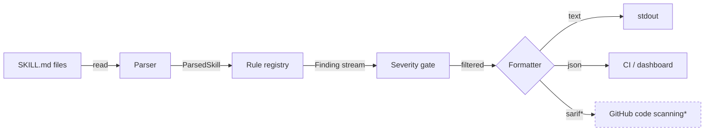
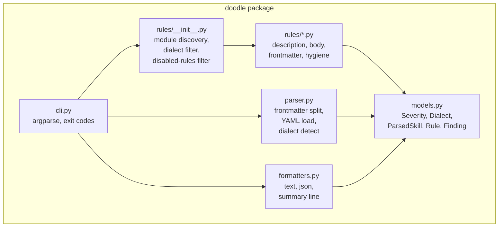
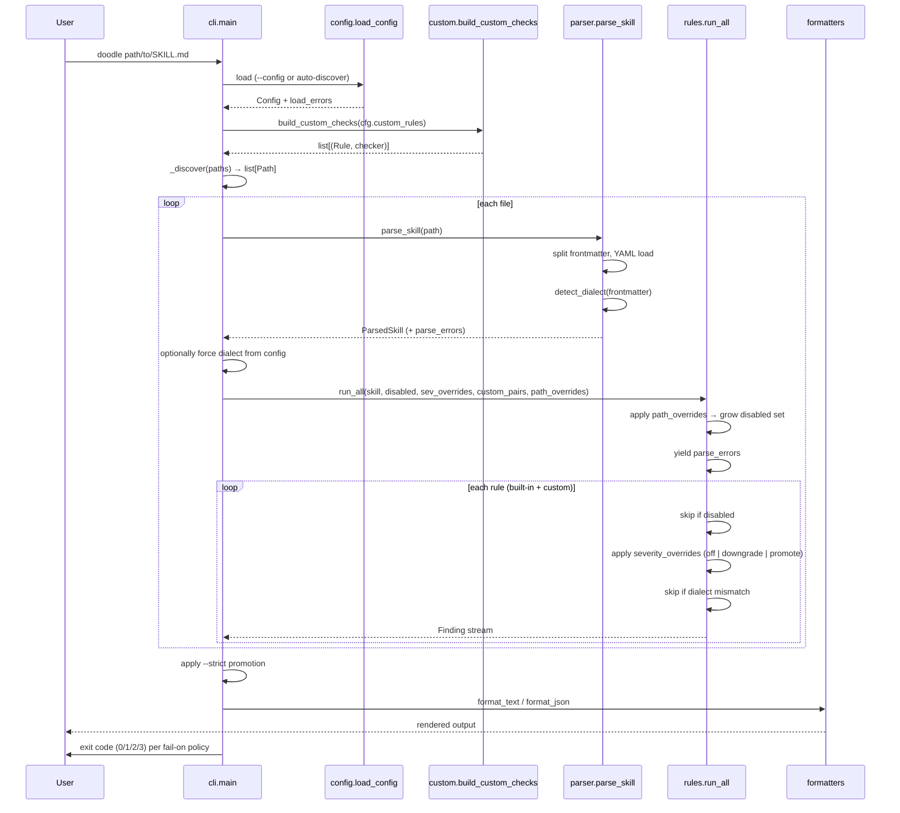

<p align="center">
  <picture>
    <source media="(prefers-color-scheme: dark)" srcset="./assets/logo-wordmark-dark.svg">
    
  </picture>
</p>

# Architecture

doodle is a static linter for Claude `SKILL.md` files. This document is a map of the codebase, the contracts between components, and the surfaces we plan to extend.

If you remember one thing: **the rule registry is the spine**. Everything else exists to feed it parsed skills and ferry findings out to humans or CI.

---

## At a glance



`*` = roadmap, not v0.

---

## Design principles

1. **One file, one truth.** Every rule operates on a single `ParsedSkill`. No global state, no cross-file inference. This makes rules trivially parallelizable and testable.
2. **Citations over opinions.** Every rule links to either an Anthropic doc, a community issue, or a measured sample frequency. Authors can see *why* and decide for themselves.
3. **Severity is a contract.** `error` blocks CI. `warning` degrades quality. `info` is style. Promotion is the user's call (`--strict`), never ours.
4. **Dialects are first-class.** Two `SKILL.md` schemas exist in the wild. The architecture treats them as enums, not as if-statements scattered through the code.
5. **No fixing in v0.** doodle reports. Authors fix. `--fix` is roadmap; doing it wrong destroys trust faster than no fix at all.
6. **Stdlib first.** Two runtime deps (`PyYAML`, `tomli` on <3.11). Adding a third requires a written justification.

---

## Components



| Component | Responsibility | Extension point |
|---|---|---|
| [`models.py`](../src/doodle/models.py) | Pure dataclasses. No logic. | Add fields to `ParsedSkill` (e.g. `code_blocks`, `headings`) when a class of rules needs them — once, in one place. |
| [`parser.py`](../src/doodle/parser.py) | File → `ParsedSkill`. Owns frontmatter splitting and dialect detection. Emits parse errors as findings so downstream still runs. | New dialects: extend `EXTENDED_HINT_FIELDS` or add a detector branch in `detect_dialect()`. |
| [`rules/`](../src/doodle/rules/) | One module per category. Each module exports `RULES` (metadata) and `CHECKS` (rule + checker pairs). | New rule: see [EXTENDING.md](./EXTENDING.md). New category: add a module and append to `_MODULES`. |
| [`rules/__init__.py`](../src/doodle/rules/__init__.py) | Registry. Aggregates rules, filters by dialect, applies disabled set. | Plugin discovery (entry points) is roadmap. |
| [`formatters.py`](../src/doodle/formatters.py) | `Finding` stream → bytes. ANSI for terminals, JSON for CI. | New formatter: add a function, wire it in `cli.py`. |
| [`cli.py`](../src/doodle/cli.py) | Argparse, path discovery, severity gating, exit codes. | Subcommands (`doodle eval`, `doodle init`) will land here as `argparse` subparsers. |
| [`config.py`](../src/doodle/config.py) | Loads `.doodle.toml` (or `pyproject.toml [tool.doodle]`) with discovery up the directory tree. Produces a typed `Config`. Reports validation errors as load-time warnings. | New top-level config keys: extend the `_parse` function. New custom rule kinds: extend `_parse_custom_rule` and `rules/custom.py`. |
| [`rules/custom.py`](../src/doodle/rules/custom.py) | Materializes `CustomRuleSpec` (from config) into `(Rule, checker)` pairs that plug into the registry alongside built-ins. Supports `pattern` and `frontmatter-required` kinds today. | New kind: add a `_check_<kind>` function and a branch in `build_custom_checks`. |

---

## Data flow: a single lint run



---

## Severity → exit code

| Outcome | Exit | Effect in CI |
|---|---|---|
| No findings, or only `info` | `0` | green |
| Any `warning`, no `error` | `1` | yellow (configurable via `fail-on`) |
| Any `error` | `2` | red |
| Tool error (bad path, etc.) | `3` | red |

`--strict` is a single uniform promotion: `info → warning → error`. No per-rule strictness in v0 — config files cover that need without growing the flag matrix.

---

## Extension points (the parts we deliberately made easy)

### Add a rule
A rule is two values: a `Rule` dataclass for metadata and a `(ParsedSkill, Rule) → Iterable[Finding]` function. Drop both into the matching category module. See [EXTENDING.md](./EXTENDING.md) for the 12-line template.

### Add a category
Create `src/doodle/rules/<category>.py` with `RULES` + `CHECKS` lists, then append the module to `_MODULES` in `rules/__init__.py`. That's it.

### Add a dialect
Extend `Dialect` enum in `models.py`, extend `detect_dialect()` in `parser.py`, then mark each rule's `dialects=` set accordingly. Dialect-scoped rules are the design's main lever for accommodating new agent ecosystems (Codex, Cursor, Gemini Gems) without forking.

### Add a formatter
Add a `format_<name>(findings) -> str` function in `formatters.py`, add the choice to the argparse `choices=` list in `cli.py`. SARIF is the obvious next one (lights up GitHub code scanning).

### Add a custom rule kind
Today: `pattern` and `frontmatter-required`. To add (say) `body-required-section`:

1. Extend the validator in [`config.py`](../src/doodle/config.py) (`_parse_custom_rule`) to accept the new kind and its fields.
2. Add a `_check_<kind>` function in [`rules/custom.py`](../src/doodle/rules/custom.py).
3. Branch on `spec.kind` in `build_custom_checks` to dispatch to it.

No core changes — the registry already routes `(Rule, checker)` pairs uniformly regardless of origin.

### Configuration sources (resolution order)
1. `--config <path>` (explicit)
2. `.doodle.toml` walking up from CWD
3. `pyproject.toml [tool.doodle]` walking up from CWD
4. Empty config

CLI flags override config values where they overlap (e.g. `--dialect` beats `[options].dialect`).

---

## Roadmap surfaces (and how the architecture supports them)

### Phase 2 — `doodle eval`: trigger-accuracy scoring

Wraps Promptfoo's `skill-used` assertion. Given a skill and a set of (prompt, should_fire) pairs, measures: does the skill actually trigger when it should, and stay quiet when it shouldn't?


**Why the existing architecture absorbs this cleanly:** `eval` is a new subcommand in `cli.py`; its output is just more `Finding` instances flowing through the same formatters and exit-code logic. No core changes.

### Phase 3 — hosted scanner + Quality Badge

Push to repo → GitHub App receives webhook → runs doodle + eval → posts PR comment + dashboard tile + badge URL (``).

**Architectural separation:** the hosted service is a separate repo and a separate code path. It calls doodle as a library (`from doodle.parser import parse_skill; from doodle.rules import run_all`). The OSS surface stays MIT and stays clean.

---

## Non-goals (deliberate)

- **Not a runtime.** doodle never executes skills, never talks to Claude during a `lint` run. (eval will, by opting in.)
- **Not a doc generator.** No `--init`, no scaffolding. There are good tools for that already (Anthropic's `skill-creator`).
- **Not a marketplace.** We grade skills; we don't host them.
- **Not a config sprawl.** No per-rule severity overrides at the CLI. Use config file or `--ignore`.
- **Not "one-size-fits-all".** Anthropic and extended dialects diverge. Some rules apply to one, some to both. We won't lie about either.

---

## Trade-offs we made (worth flagging)

| Decision | Why | Cost |
|---|---|---|
| Python over Rust/Go | Matches Anthropic's own `skill-creator`; widest contributor pool for OSS rules. | Startup time ~80ms slower than a single binary. Acceptable for CI; matters at watch-mode scale (roadmap). |
| `argparse` over `click`/`typer` | Stdlib. Zero extra deps for a CI tool. | Slightly less ergonomic API. |
| YAML via `PyYAML` | The dependency the ecosystem already has. | One C-ext install on some platforms. |
| Findings as a flat list, not a tree | JSON output stays trivial; CI consumers are simpler. | No "this finding caused that finding" chains. We don't need them yet. |
| Hard cap `body/way-too-long` at 1500 lines | First-party Anthropic skills (`docx`, `skill-creator`) blow the 500 soft cap. A hard 500 would call them errors — wrong signal. | Some legitimately-large skills will still trip it. We surface as `error` because at 1500 lines, it almost certainly should have been split. |
| No `--fix` in v0 | A wrong auto-fix on a 5000-author corpus erodes trust in one bad release. | Authors must apply suggestions by hand. Roadmap. |

---

## File map

```
doodle/
├── action.yml                     # composite GitHub Action
├── pyproject.toml                 # package metadata
├── README.md                      # user-facing entry
├── RULES.md                       # rule spec (root for visibility)
├── LICENSE                        # MIT
├── docs/
│   ├── ARCHITECTURE.md            # this file
│   ├── WHY.md                     # impact argument
│   ├── EXTENDING.md               # contributor rule guide
│   └── assets/
│       ├── logo-mark.svg
│       ├── logo-banner-light.svg
│       ├── logo-banner-dark.svg
│       ├── logo-wordmark-light.svg
│       ├── logo-wordmark-dark.svg
│       ├── mascot.svg
│       └── mascot-no-bg.svg
├── src/doodle/
│   ├── __init__.py
│   ├── cli.py                     # entry: `doodle ...`
│   ├── parser.py
│   ├── models.py
│   ├── formatters.py
│   └── rules/
│       ├── __init__.py            # registry
│       ├── description.py
│       ├── body.py
│       ├── frontmatter.py
│       └── hygiene.py
├── tests/
│   ├── test_rules.py
│   └── fixtures/                  # SKILL.md fixtures, one per scenario
└── .github/workflows/ci.yml
```
